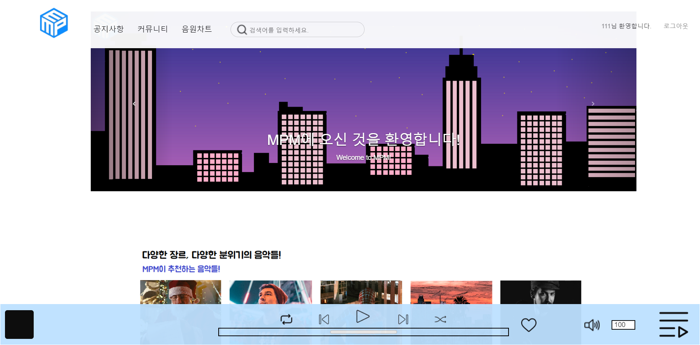
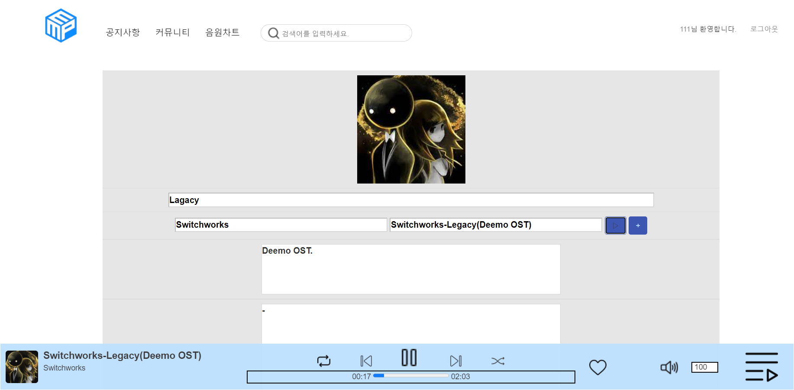

# MPMproject
## SpringMVC 기반 음원 공유사이트
### 한국ICT인재개발원 3차 팀프로젝트 2조 (조연후, 양민규, 박근호, 김태윤, 유창수)
-----------------------
### 과정명
 - [2021년 하반기](스마트웹&콘텐츠 개발)웹기반 스마트 콘텐츠 응용 SW 개발자 양성과정
 - 해당 과정 수료기간 : 2021.8 ~ 2022.2 (6개월)
### 본 프로젝트 개발기간 : 2022.1 ~ 2022.2 (1개월)
-----------------------
### 사용기술 & TOOLS
 - Spring 5 ver. / sts 3.x ver
 - HTML5/CSS
 - OracleDB 18g
 - AJAX
 - JavaScript
 - Bootstrap
 - JQuery
-----------------------
### 프로젝트 개요
- Spring 및 JavaScript, HTML과 OracleDB를 사용하여 MVC패턴으로 음원을 공유하거나 스트리밍 할 수 있는 사이트를 구현

-----------------------
### 주요 화면 스크린샷 & 설명
 
- 메인화면 : 홈페이지 설명 및 재생바 UI 표시   

 
- 음원페이지 : 음원에 대한 정보 표시 및 재생바를 이용한 음원 스트리밍 기능   
-----------------------
> Written with [StackEdit](https://stackedit.io/).